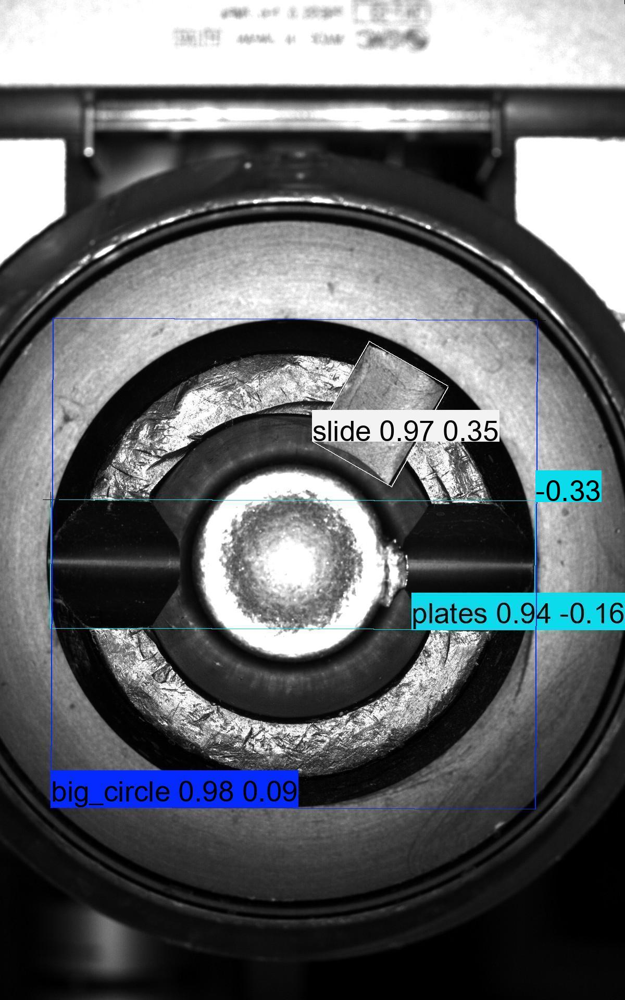
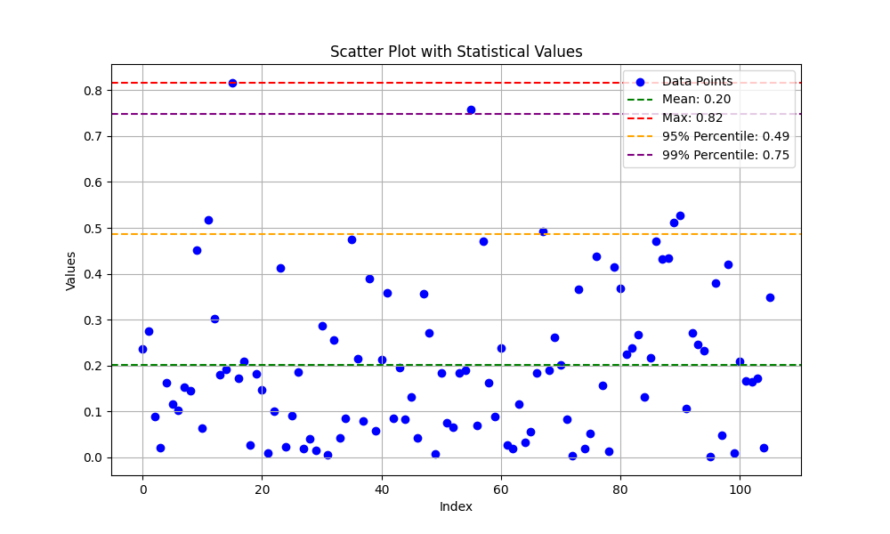
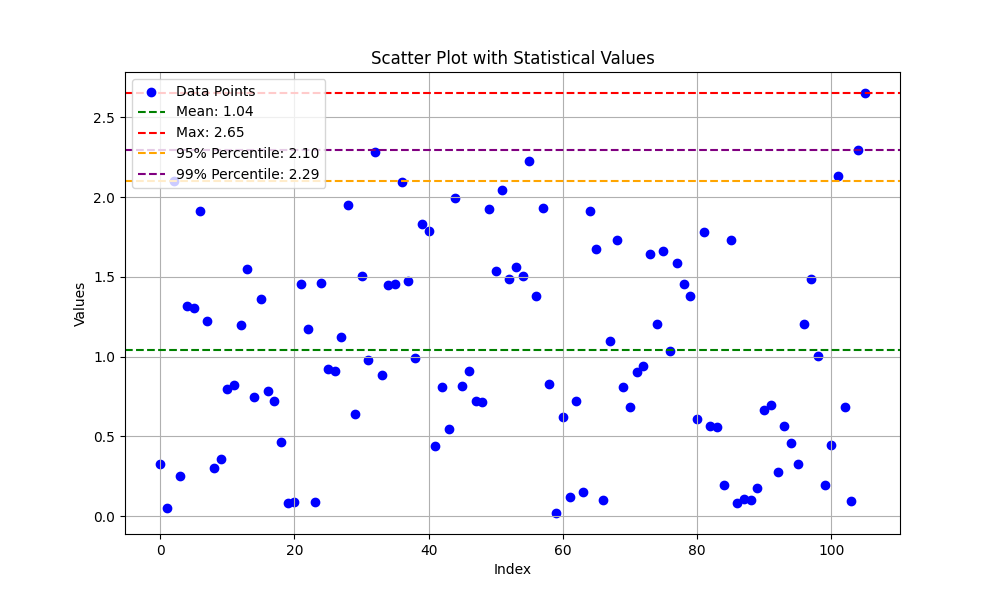
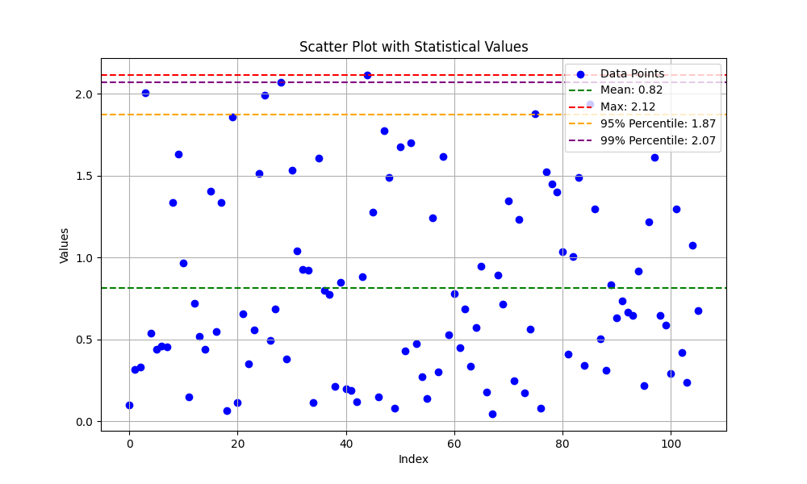

# PrecisionAngleDetection
## quick start
* install environment
    * with virtualenv
    ```
    conda create --name ${mypyenv}
    conda activate ${mypyenv}
    pip install -r requirements.txt
    git clone --recursive https://github.com/johnson-magic/PrecisionAngleDetection.git
    cd PrecisionAngleDetection
    ```


    * with docker
    ```
    docker build -t ${image} -f docker/Dockerfile .
    git clone --recursive https://github.com/johnson-magic/PrecisionAngleDetection.git
    docker run -ti --entrypoint=/bin/bash -v ./PrecisionAngleDetection:/workspace/PrecisionAngleDetection  ./{data}:/data/datasets ${image}
    cd /workspace/PrecisionAngleDetection
    ```

* train

    ```
    python3 train_and_val.py
    ```

* metric
    * 生成验证集的真值

    ```
    python3 tools/get_angle_gt_by_plates.py --test_dataset_labels_root ./../datasets/obb-project/labels/val
    ```
    * 生成metric结果
    ```
    python3  tools/metric.py --test_dataset_images_root {images/val/} --test_dataset_labels_root {labels/val} --best_model_path {weights/best.pt}
    '''
* vis
    * badcase

        

    * index

        
        
        